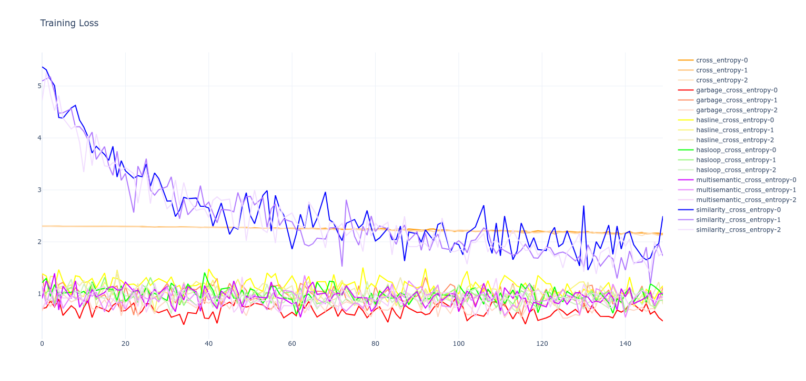
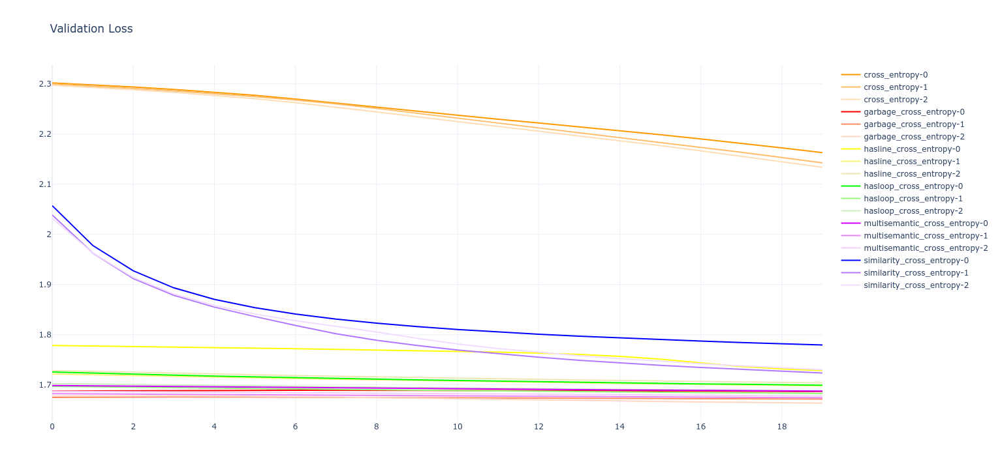
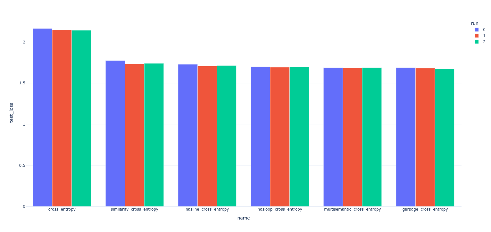
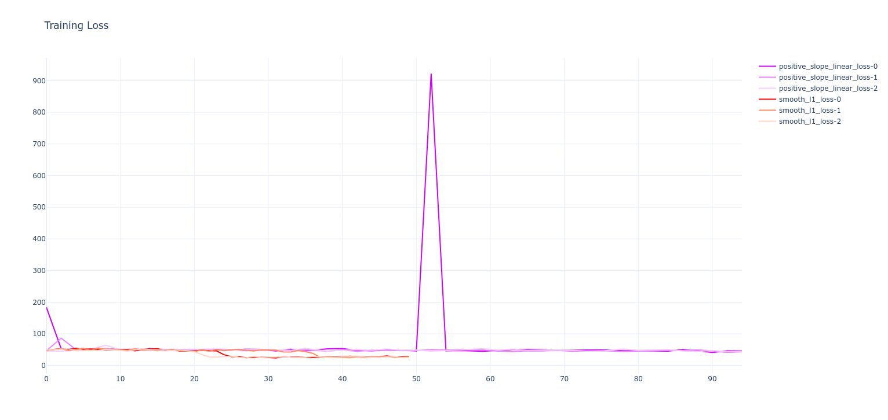
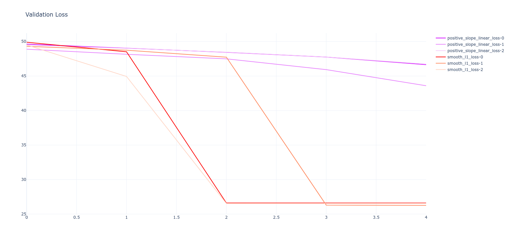
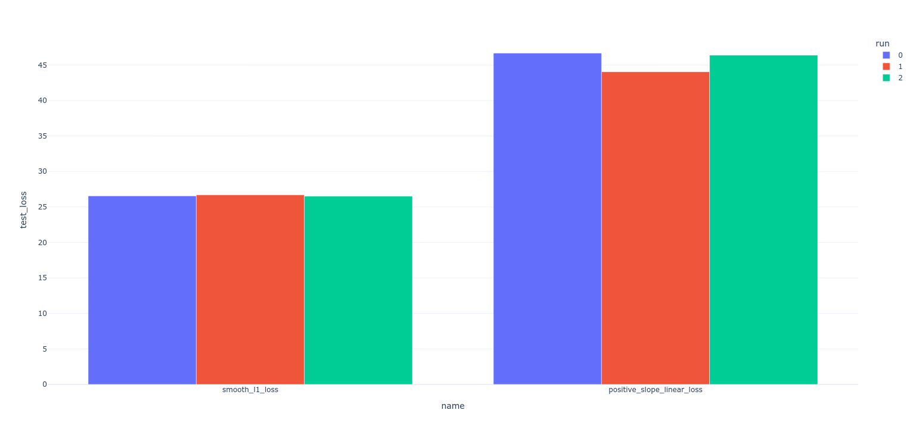

# Overview

This is a testing sandbox for developing various methods of injecting symbolic knowledge into neural networks. This symbolic NN approach is intended to facilitate the training of models for physics based problems where process complexity and data availability are generally significant hindrances to the application of NNs. By injecting known, symbolic human knowledge we aim to guide the model towards the correct embedding space more quickly than could be achieved through pure statistical loss.

# Experiments

## Experiment 1 - Relationally embedded Semantic Loss Functions (SLF)

### Planning

- Simple semantic loss based on intuitively noticeable properties of numeric characters
- Makes use of manually made reward matrices to weight rewards depending on how "close" the model was
- Very rudimentary example of semantic loss

### Results

- Training loss

- Validation loss

- Test loss


### Conclusions

- Seems to have worked
    - Clear improvement in training rate with semantics added
    - Similarity cross entropy in particular shows clear signs in validation loss of being on a similar complementary CDF to the normal cross-entropy loss, but training faster
- Interestingly: the "garbage" cross entropy seems to have also produced a very good result! This is likely because it hasn't been normalized to 1, so it may be simply amplifying the gradient by random amounts at all times. Basically acting as a fuzzy gradient booster.
- I would consider this experiment a success, with some interesting open questions remaining worth further examination

## Experiment 2 - Dataset qualitative characteristic derived SLFs

### Planning
- Makes use of known physics equations that partially describe the problem to guide the model
    - Reduces the need for the model to learn known physics, allowing it to focus on learning the unknown physics
    - Should accelerate training
    - Allows for easier model minimisation
- Dataset selection will be important here
    - Needs to be a familiar area to the experimenter
    - Needs to be openly available
    - Needs to describe a problem complex enough that we wouldn't just be fitting on a known equation (e.g: if we were to try Hooks law we would just fit to the equation which would be pointless)
- Possible candidate datasets:
    - [Molecular Properties](https://www.kaggle.com/datasets/burakhmmtgl/predict-molecular-properties)
    - [Nuclear Binding Energy](https://www.kaggle.com/datasets/iitm21f1003401/nuclear-binding-energy)
    - [Body Fat Prediction](https://www.kaggle.com/datasets/fedesoriano/body-fat-prediction-dataset)
- Decided to use Molecular Properties dataset as it is quite familiar to me
- Training with semantics added to renationship between molecular energy and differential electronegativity
    - Semantics being injected are:
        - These values should be positively corellated
        - These values should be weighted towards a high r^2 with an adaptive penalty
    - Multiple attempts carried out:
        - Simple penalties. Variations tested include:
        ```math
        Loss = ( Softplus( -m ) + 1 ) * SmoothL1Loss
        ```
        ```math
        Loss = ( Relu( -m ) + 1 ) * SmoothL1Loss
        ```
        ```math
        Loss = ( \frac{1}{Sech(|r|)} + 1 ) * SmoothL1Loss
        ```
        ```math
        Loss = ( {r}^2 + 1) * SmoothL1Loss
        ```
        - Adaptive, self training penalties tuned by various methods. Best method found was optimisation by a random forest regressor. These tunable variants include:
        ```math
        Loss = ( Softplus( \alpha * -m ) + 1 ) * SmoothL1Loss
        ```
        ```math
        Loss = ( Relu( \alpha * -m ) + 1 ) * SmoothL1Loss
        ```
        ```math
        Loss = ( \frac{ 1 }{ Sech( \alpha * |r| ) } + 1 ) * SmoothL1Loss
        ```
        ```math
        Loss = ( \alpha * { r }^2 + 1) * SmoothL1Loss
        ```
        - Final adaptive semantic loss function tested (called `positive_slope_linear_loss`) was the following:
        ```math
        Loss = ( \alpha * { r }^2 + 1) * ( \frac{ 1 }{ \beta } * log( 1 + exp( \beta * \gamma * -m ) ) + 1 ) * SmoothL1Loss
        ```

### Results

- Training loss

- Validation loss

- Test loss


### Conclusions

- Method didn't appear to work too well because:
    - Simple loss functions tested were likely suboptimal for effectively influencing model
    - Guesses at parameters in simple functions need to be optimised, basically turning this into a hyperparameter optimisation problem, which defeats the purpose of semantic loss
    - Adaptive, ML based loss functions do not appear to be converging quickly enough to train the model faster than the normal loss functions
- For this reason, I would conclude this experiment as a failure

## Experiment 3 - Tensor Logic Network (TLN)

- Revisiting QMNIST from Expt1 but using TLN instead of SLF.
- Using LTNtorch library, as manually defining logical constraints would be a pain here.
- Will create formalised logic definitions of non-fuzzy relations manually embedded in Expt1:
    - Numbers with Lines:
    ```math
    \forall x ( Numeral(x) \to \exist HasLine(x) \oplus \exist NoLine(x) )
    ```
    - Numbers with Loops:
    ```math
    \forall x ( Numeral(x) \to \exist HasLoop(x) \oplus \exist NoLoop(x) )
    ```
    - Where:
    ```math
    Zero(x) \to NoLine(x) \land HasLoop(x) \\
    One(x) \to HasLine(x) \land NoLoop(x) \\
    Two(x) \to NoLine(x) \land NoLoop(x) \\
    Three(x) \to NoLine(x) \land NoLoop(x) \\
    Four(x) \to HasLine(x) \land NoLoop(x) \\
    Five(x) \to HasLine(x) \land NoLoop(x) \\
    Six(x) \to NoLine(x) \land HasLoop(x) \\
    Seven(x) \to HasLine(x) \land NoLoop(x) \\
    Eight(x) \to NoLine(x) \land HasLoop(x) \\
    Nine(x) \to HasLine(x) \land HasLoop(x)
    ```

## Experiment 4 - Physics informed SLFs

### Planning

- Attempt to use more mathematically rigorous, formalised, and literature based approach to semantic loss functions.
- Although understudied, semantic loss has had a lot of theoretical maths done exploring the concept, and we need to figure out how to put this into code.
